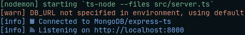

# Express Typescript Docker Starter Kit + Boilerplate

A curated starter kit for backend Node.js development. REST API with Typescript, Express, Mongoose, Jest, Docker, and more.<br/>

## Features

- **Typescript** support with `ts-node` and `tsc` for production builds.
- **Docker** support with `docker-compose` for development and production environments.
- **Testing** with `jest` and `supertest` for unit and integration tests.
- **MongoDB** object modeling with `mongoose`.
- `Migrate-mongo` for database migrations.
- `AWS S3` integration for file uploads.
- `Authentication` management system with **access** and **refresh** **JWTs**. Following the **OAuth 2.0** standard with refresh token **encryption** and **blacklisting**.
- `Private` and `public` endpoints.
- **Error handling** inside and outside the **express** middleware chain with `express-async-errors`.
- **Logging** with `winston`.

## Table of Contents

1. [Installation](#1-installation)
   <!-- 1. [Clone the repository](#11-clone-the-repository)
   2. [Install dependencies](#12-install-dependencies) -->
2. [Configuration](#2-configuration)
   <!-- 1. [NPM scripts](#21-npm-scripts)
   2. [Environment variables](#22-environment-variables)
3. [Development](#3-development) -->
   <!-- 1. [Hybrid mode](#31-hybrid-mode)
   2. [Immersive mode](#32-immersive-mode)
   3. [Common](#33-common)
   4. [Testing](#34-testing) -->
4. [Deployment](#4-deployment)
   <!-- 1. [Compile and run locally](#41-compile-and-run-locally)
   2. [Build and run with Docker](#42-build-and-run-with-docker) -->
5. [The Project](#5-the-project)
   <!-- 1. [Models](#51-models)
   2. [Routes](#52-routes)
   3. [Testing](#53-testing)
   4. [Utilities](#54-utilities)
   5. [Docker](#55-docker)
   6. [Scripts](#56-scripts) -->
6. [Contributing](#6-contributing)

## 1. Installation

### 1.1. Clone the repository

```sh
git clone https://github.com/j0rdiC/express-docker-typescript-starter-kit.git app_name
```

### 1.2. Install dependencies

```sh
cd app_name
npm install
```

<br/>

## 2. Configuration

### 2.1. NPM scripts

Configured in `package.json`. Big focus on **automation** for a **productive** development **experience**.<br/>

```sh
npm run
```

### 2.2. Environment variables

Stored in `.env.default`. Rename it to .env and update the values as needed.
<br/><br/>

## 3. Development

### 3.1. Hybrid mode

Run **MongoDB** as a service in a **docker** container and **start** the server **locally**. **Data persistance** enabled. Refer to the scripts folder, see [db.sh](scripts/db.sh) and its respective [compose file](docker/docker-compose.db.yml).

```sh
npm run dev:db
```

You can also **just** run the **server** locally as usual. Make sure to provide a MongoDB connection string.

### 3.2. Immersive mode

Run both the **server** and **MongoDB** in **docker** containers. **Data persistance** with **hot reload** enabled.
Refer to the scripts folder, see [docker-dev.sh](scripts/docker-dev.sh) and its respective [compose file](docker-compose.dev.yml).

```sh
npm run dev:docker
```

### 3.3. Common

Run **database migrations** to populate the database.

```sh
npm run db:up
```

**Both hybrid and immersive modes will result in**:



- MongoDB running on `mongodb://localhost:27017`
- Server running on `http://localhost:8000`

### 3.4. Testing

```sh
npm run test
```

Three optional modes:

- `test` - Run the test suites.
- `test:watch` - Run the test suites in watch mode.
- `test:coverage` - Run the test suites and generate a coverage report.
  <br/>

## 4. Deployment

### 4.1. Compile and run locally

```sh
npm run build && npm start
```

### 4.2. Build and run with Docker

Make sure to provide **environment variables** when building with Docker. Either in the `docker-compose` file or **CLI**.<br/>

From the **command line**.

```sh
docker build -t api .

docker run -t -i -p 8000:8000 \
    --env NODE_ENV=production \
    --env PORT=8000 \
    --env DB_URL='mongodb://<mongo_url>' \
    api
```

With **docker-compose**:

```sh
docker-compose up --build
```

<br/>

## 5. The Project

You can find a lot of useful stuff in this project. Here are some of them.

### 5.1. Models

- Mongoose modelling with proper typing for a nice development experience.
- Note that type definitions are in [types.d.ts](src/types.d.ts), no need to import them.
- Two defined models: **User** and **Group**.
- Model instance methods for authentication and CRUD operations.
- Operations with related collections.

### 5.2. Routes

- Authentication management system with access and refresh JSON Web Tokens.
- `NOTE`: This api is ment for a **mobile device**, so on the **client** the refresh token is saved in the **secure-storage** of the device. If this was for a **web app**, the refresh token would be sent and saved in a **http-only cookie**.
- Authentication and authorization middlewares for protected endpoints.
- Other usefull middlewares to upload files, validate requests, etc.
- A route **handler factory** for common CRUD endpoints. See [factory.ts](src/controllers/factory.ts).
- **No** wrapping your routes in **try/catch** blocks, **express-async-errors** monkey-patches the route handlers to catch errors and pass them to the next middleware.

### 5.3. Testing

- Nice and clean test suites.
- **Unit** and **integration** tests with jest and supertest.
- Test utilities for authentication and database operations.

### 5.4. Utilities

- **AWS S3** integration for file uploads.
- Utitilty functions for **hashing**, **sorting** by distance **from coordinates**, etc.
- Function to **invoque** a **python process** from node. In case you miss typing proper clean code.

### 5.5. Docker

- Dockerfile for production.
- Docker-compose to run MongoDB as a service.
- Docker-compose for development and production environments.

### 5.6. Logging

- Logging with **winston**. See [logger.ts](src/logger.ts).
- Logging to **console** with prettefied output during development.
- Logging to `./logs` with **timestamps** and **readable** output.

### 5.7. Scripts

- `dev` - Run the server locally.
- `dev:db` - Run the server locally and MongoDB in a Docker container.
- `dev:docker` - Run the server and MongoDB in Docker containers.
- `build` - Compile the Typescript code.
- `start` - Run the compiled code.
- `test` - Run the test suites.
- `test:watch` - Run the test suites in watch mode.
- `test:coverage` - Run the test suites and generate a coverage report.
- `db:up` - Run database migrations.
- `db:down` - Rollback database migrations.
- `db:reset` - Rollback and run database migrations.
- `cleanup` - Remove logs, coverage reports and compiled code.
  <br/>

# 6. Contributing

Feel free to contribute. Any improvement to the project is welcomed.<br/>
**Hope you like my work and coding style**, I am open to suggestions and feedback.
